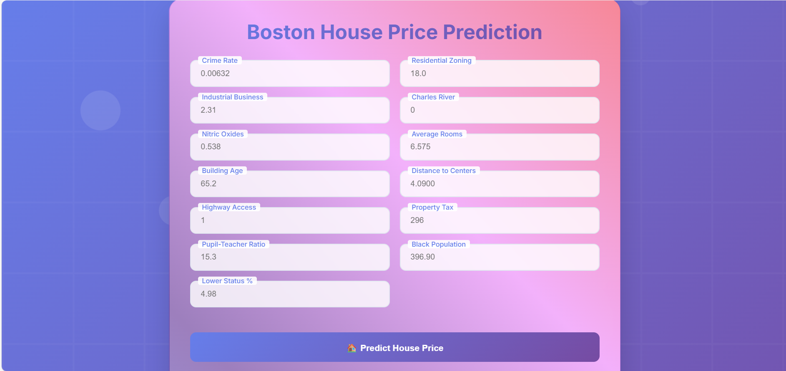

# 🏡 Boston House Price Prediction

This project uses a machine learning model to predict house prices based on various features such as crime rate, number of rooms, property tax, and more. The dataset originally comes from the [StatLib library](http://lib.stat.cmu.edu/datasets/boston), but due to ethical issues, it is no longer included in scikit-learn by default.

---

## 📁 Project Structure
Boston-House-Price-Prediction

├── static/ # Static files (CSS, images if any)

├── templates/ # HTML templates for the frontend

├── venv/ # Python virtual environment

├── app.py # Main Flask app script

├── LICENSE # License file

├── README.md # This file

├── regmodel.pkl # Trained regression model

├── scaler.pkl # StandardScaler used for preprocessing

├── requirements.txt # Python dependencies

├── .gitignore # Files to ignore in version control

├── Boston House Price.ipynb # Jupyter notebook for training and EDA

## 🧰 Tools and Technologies Used

- Python 3.7+
- Flask
- Pandas, NumPy
- Scikit-learn
- Matplotlib / Seaborn (for EDA)
- HTML, CSS (via Jinja templates)
- VS Code or Jupyter Notebook

How to run the code
--------------------------
*. Clone the Repo
1. conda create -p ./venv python=3.7 -y
2. conda init cmd.exe
3. conda activate ./venv
4. pip install -r requirements.txt
5. python app.py

🧪 Model Training
The regression model (regmodel.pkl) and the scaler (scaler.pkl) are generated by training on the Boston Housing dataset inside the Jupyter notebook (Boston House Price.ipynb).

OUTPUT
